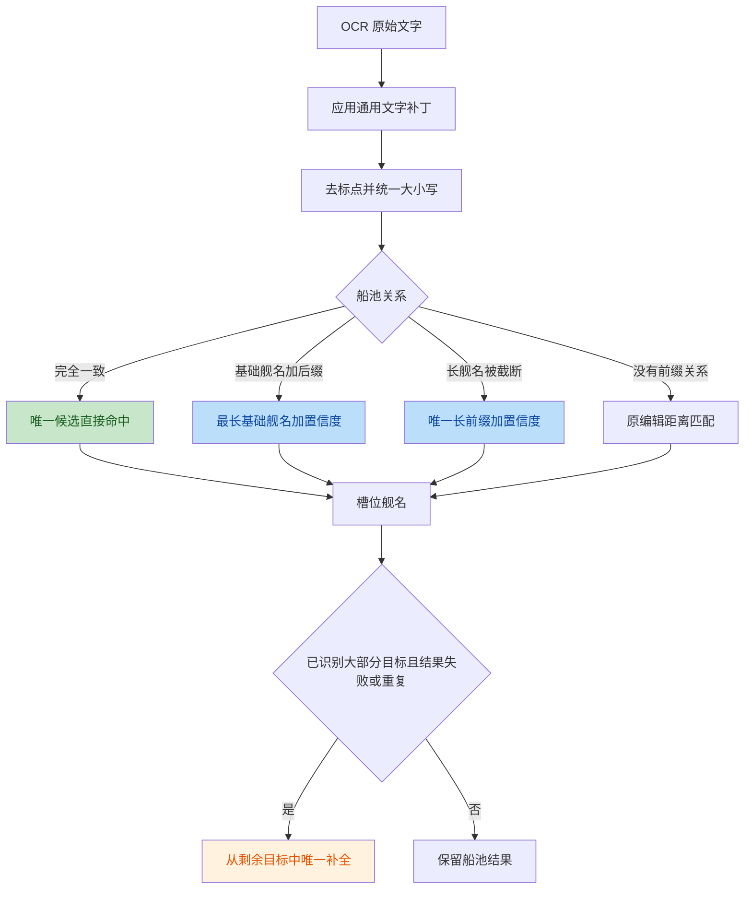

# Feat：舰名 OCR 匹配调优

## 状态

- 日期：2026-08-01
- 状态：已完成首版，开放 dev 测试
- 范围：舰名 OCR、船池匹配和目标舰队上下文，不包含 YAML 格式。

## 为什么要改

原实现只使用 Levenshtein 编辑距离在完整船池中找最近舰名，存在以下问题：

- `·`、`:`、`-` 和空格等符号识别不稳定，同一舰名可能因为标点不同而匹配失败。
- 自定义舰名常表现为“基础舰名 + 后缀”，纯编辑距离容易拒绝正确基础舰名。
- 长舰名可能被 OCR 截断，但短前缀直接匹配又会误伤大量一至三字舰名。
- `Z1`、`Z16`、`Z17` 等短舰名相近，全船池匹配容易选错。
- 智能换船已经知道目标队伍，但原检测无法利用这个上下文修正最后一个模糊结果。

## 匹配流程

## 具体改动

### 可配置置信度

- `OCRConfig` 新增 `ship_name_match_confidence`，默认值为 `0.65`，取值范围为 `0` 至 `1`。
- `0` 表示关闭船池感知规则，继续使用原编辑距离逻辑。
- `launcher.py` 创建 OCR 引擎时同步参数。
- 启用后输出日志：`OCR置信度匹配机制加载（当前参数：0.65）`。

### 船池感知匹配

- 匹配前移除标点和空格，统一字母大小写，保留中文、字母和数字。
- 归一化后完全一致时，只有唯一候选才接受。
- OCR 文字以基础舰名开头时，按自定义后缀处理，基础舰名至少保留两个字符，并优先最长基础舰名。
- 舰名以 OCR 文字开头时，按截断处理；OCR 至少保留四个字符，且共享前缀的候选只能有一个。
- 置信度使用对称前缀 Dice：`2 × 公共前缀长度 ÷ (OCR 长度 + 舰名长度)`。
- 同时符合自定义后缀和截断关系、候选不唯一或低于阈值时拒绝猜测。
- 不存在可解释的前缀关系时，保留原编辑距离匹配，兼容旧行为。
- 选船页比较目标舰名与 OCR 船池结果时复用同一套匹配规则。

### 目标舰队上下文

- `detect_fleet()` 支持传入 `expected_names`。
- 完整船池必须先识别出目标队伍中除至多一艘外的其他成员，才启用上下文。
- 只有船池匹配失败，或重复命中已被其他槽位占用的目标舰名时才补全。
- 只从尚未占用的目标舰名中选择编辑距离 `2` 内唯一的最近项。
- 智能换船使用该能力；普通检测、`event_fight.py`、`normal_fight.py` 和旧决战流程不传目标上下文。

### 实现精简

完全一致、自定义后缀和 OCR 截断原先拆成四个一次性辅助函数，现合并到一个船池匹配函数。
行为保持不变，`ocr.py` 相对主分支的改动由约 `+219` 行减少到约 `+122` 行。

## 已解决

- 标点差异造成的同舰名匹配失败。
- 可解释的自定义后缀和唯一长舰名截断。
- 短舰名、共享前缀和归一化后重名时的盲目猜测。
- `Z1` 系列在目标舰队大部分成员已确认时的最后一项补全。
- 置信度参数从配置加载并在启动日志中可见。

## 未解决

- 目标上下文是带目标答案的补全，不是独立于目标的二次验证。
- 上下文补全使用固定编辑距离 `2`，暂不读取 `ship_name_match_confidence`。
- 非前缀型 OCR 错字仍依赖旧编辑距离，无法使用前缀置信度解释。
- 自定义舰名、基础舰名和同舰别名尚未形成统一身份模型。
- 本地补充的 `autowsgr/data/shipnames.yaml` 不进入本次提交。

## 验证

- OCR 基础与船池匹配测试：`71 passed`。
- 881 艘船池的自定义后缀、阈值边界和截断场景：`8 passed`。
- 准备页目标上下文和换船测试：`83 passed`。
- Ruff、格式检查和 `git diff --check` 通过。

## TODO

- 评估目标上下文是否与 `ship_name_match_confidence` 共用阈值。
- 为目标上下文补充独立实机日志，确认误补全比例。
- 统一基础舰名、自定义舰名和别名的身份判断。
- 扩充非前缀错字、短舰名和归一化重名样本。
