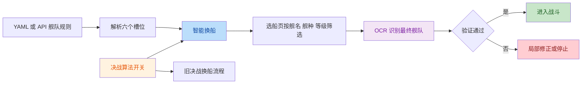

# 本轮智能换船与 OCR 功能总览

## 发布范围

本轮共保留 5 个专题 feat：

| 数量 | 状态 | 专题 |
| --- | --- | --- |
| 3 | 已实现，进入 dev 测试 | OCR 舰名匹配、智能换船、决战算法开关 |
| 1 | 部分实现 | GUI 与后端作战计划 YAML 契约 |
| 1 | 仅记录 TODO | 决战模块独立入口重构 |

原有专题文档全部保留，本文件只提供发布总览，不代替各专题的实现说明。

## 整体流程

## 1. 舰名 OCR 匹配调优

文档：`feat-ocr-ship-name-matching.md`

功能：

- 忽略标点和大小写差异，保留中文、字母和数字。
- 支持唯一的基础舰名、自定义后缀和长舰名截断关系。
- 使用可配置置信度拒绝短舰名、歧义前缀和低可信匹配。
- 智能换船可在大部分目标已确认后，用目标上下文补全最后一个模糊结果。

解决：

- 标点、自定义后缀和 OCR 截断导致的舰名匹配失败。
- `Z1` 系列等相近短舰名在目标舰队中的部分识别问题。

未解决：

- 目标上下文不是独立二次验证。
- 上下文仍使用固定编辑距离 `2`。
- 基础舰名、自定义舰名和别名尚未统一身份。

## 2. 智能换船算法

文档：`feat-smart-fleet-change.md`

功能：

- 六个槽位分别使用自己的固定舰名或候选列表。
- 使用回溯为槽位分配不同舰名，避免同舰名重复入队。
- 首次完整对齐，失败后只修正错误槽位。
- 1 队槽位 0 先替换后移除，避免舰队被清空。
- 修复 `Lv.` 标签与等级数字分离、`110` 被识别为 `Il0` 等等级 OCR 问题。
- 换船失败返回 `False`，作战入口立即停止。

解决：

- 槽位候选被错误合并成全局候选。
- `AB -> C` 时先移除导致一队为空。
- `min_level=100` 时无法识别实际为 `110` 的舰船。
- 验证失败后重复调整整支舰队。
- 换船失败后仍带错误舰队出征。

未解决：

- 已在队伍中的同名舰只比较舰名，尚未复核 `ship_type`、`min_level` 和 `max_level`。
- 1 队先替换后移除尚未完成实机验证。

## 3. 决战换船算法开关

文档：`feat-decisive-fleet-change-algorithm-switch.md`

功能：

- 默认继续使用原决战换船流程。
- 开启 `use_new_fleet_change_algorithm` 后使用智能换船。
- YAML 配置和决战 API 使用同一个开关字段。

解决：

- 新算法无法逐步开放给决战测试的问题。
- 关闭新算法时决战无法继续使用旧流程的问题。

未解决：

- 开关开启和关闭都需要完成决战整章实机回归。

## 4. 作战计划 YAML 契约

文档：`feat-unified-combat-plan-yaml.md`

当前完成：

- 后端读取并保存 `fleet_presets`。
- 只做列表类型检查、字符串去空格和候选顺序去重。
- 不在后端轮询多套 preset；一次出击只执行 GUI 或 API 选定的一套舰队。

未解决：

- GUI、YAML parser 和 HTTP API 尚未共享同一份 Schema。
- `priority`、`nation` 等 GUI 编排字段尚未统一转换。
- 部分 API 字段仍存在“接受但未传入运行模型”的情况。

## 5. 决战模块入口重构

文档：`feat-refactor-decisive-fight-module.md`

本轮只记录设计，不移动生产代码。目标是在后续将决战入口整理为
`autowsgr/ops/decisive_fight.py`，与普通战和活动战入口平级。

## 发布前本地验证

- 准备页与智能换船单元测试：`83 passed`。
- OCR 基础匹配测试：`71 passed`。
- 881 艘船池场景测试：`8 passed`。
- Ruff、格式检查和 `git diff --check` 通过。

测试代码仅用于本地验证，不进入本次个人分支提交。

## 后续 TODO

1. 完成决战旧流程与新算法的整章实机回归。
2. 实机验证 1 队槽位 0 的先替换后移除流程。
3. 复核已有同名舰的舰种和等级条件。
4. 统一目标上下文与全船池置信度规则。
5. 完成 GUI、YAML 和 API 的共享 Schema。
6. 将决战入口重构到 `autowsgr/ops/decisive_fight.py`。

## 本次提交边界

- 提交生产代码和 6 份 feat 文档。
- 不提交 `testing/`、`.dbg/`、调试文档和本地测试计划。
- 不提交本地临时修改的 `autowsgr/data/shipnames.yaml`。
- 不提交本地 `usersettings.yaml`。
