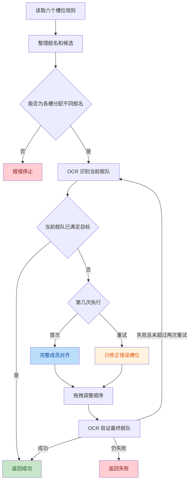

# 智能换船算法

## 状态

核心算法已实现，已完成非核心代码清理和重复逻辑精简。

## 目标

根据六个舰队槽位的规则完成换船，并保证：

- 固定舰名和槽位候选都能使用。
- 每个槽位只使用自己的候选。
- 同一舰队不会选择两个标准舰名相同的舰船。
- 1 队槽位 0 不会被清空。
- 首次整体调整失败后，只修正错误槽位。
- 换船结果经过 OCR 再次确认，失败时返回 `False`。

## 输入

每个槽位支持三种形式：

```yaml
ships:
  - 飞龙
  - candidates: [岛风, 黑潮]
    search_name: 岛风
    ship_type: dd
    min_level: 100
    max_level: 110
  - null
```

- 字符串：固定舰名。
- 规则对象：按顺序尝试 `candidates`，并把舰种、等级等条件交给选船页面。
- `null`：该槽位应为空。

不足六个槽位时在末尾补空位。
超过六个槽位时只读取前六个槽位。

每次只接收并执行一套 `ships`。不会在第一套舰队失败后继续尝试其他
preset，换船失败时直接停止当前作战流程。

## 当前流程



## 核心改动

### 槽位候选

候选不再合并成全局船池。每个槽位只读取自己的 `candidates`，
并按填写顺序选择。

### 同名舰分配

换船前使用回溯分配六个槽位，确保不同槽位不会得到同一个标准舰名。
如果候选无法组成不重复的舰队，直接报错，不进入选船页面。

### 完整对齐

第一次执行时：

1. 保留当前舰队中已经满足目标的舰船。
2. 先替换或补充缺少的舰船。
3. 再从后往前移除多余舰船。
4. 因槽位压缩导致缺员时再次补齐。

### 1 队槽位 0

1 队槽位 0 不能为空。执行 `AB -> C` 时先把槽位 0 的 `A`
直接替换成 `C`，然后移除 `B`，不会先把舰队清空。

### 局部修正

首次验证失败后不再整体重做。算法先找出错误槽位，只替换或移除这些槽位，
随后重新排序和验证，最多局部修正两次。

### 实际入队舰名

候选第一项不代表实际入队舰船。选船页面会返回实际选择结果，
算法用该结果更新目标和后续验证，不使用 `candidates[0]` 伪造舰名。

选船页面已经按舰名、`ship_type`、`min_level`、`max_level` 完成筛选时，
换船算法信任选船结果。最终 OCR 只确认舰名和槽位，不再二次识别舰种和等级。

### 等级 OCR

- 等级 `110` 在 720P 下可能被识别为 `Il0`、`ll0`，允许两个数字易混淆字符。
- `Lv.` 标签和等级数字被 OCR 拆成两个结果时，合并同一区域内的高置信度纯数字。
- 没有识别到 `Lv.` 标签时，只接受大于等于 `100` 的三位等级，避免把其他数字当成等级。

该修复解决了选船页已经显示 `110`，但 `min_level=100` 仍被判断为无可用舰船的问题。

## 与其他 feat 的边界

- OCR 原文、模糊匹配和目标舰名上下文属于
  `feat-ocr-ship-name-matching.md`。
- GUI 与后端 YAML 格式统一属于
  `feat-unified-combat-plan-yaml.md`。
- 决战是否启用新算法属于
  `feat-decisive-fleet-change-algorithm-switch.md`。
- 作战执行器只调用 `change_fleet()` 并处理成功或失败，不参与换船细节。

## 已删除的非核心代码

- `_report_fleet_debug()`、`_report_level_debug()` 及所有本地网络调试上报。
- `change_fleet_with_fallback()` 多 preset 轮询。
- 仅供测试读取的 `last_resolved_ship_names` 状态及对应测试。
- 只测试多 preset fallback 的专项实机测试。

`expected_names` 已确定保留，具体启用条件和已知边界记录在
`feat-ocr-ship-name-matching.md`。

## TODO

- 已在队伍中的同名舰船只根据舰名判断，尚未重新确认
  `ship_type`、`min_level`、`max_level`。
- 后续只处理上述“已有同名舰是否应触发重新选择”的问题。真正进入选船页面
  并按约束选中后，不增加二次确认。

## 已完成验证

- 1 队 `AB -> C` 的替换顺序单元测试。
- 槽位级候选和同名舰去重单元测试。
- 固定舰名、候选和局部修正单元测试。
- 突击者同名舰的 `cv`、`cvl` 舰种实机选择。
- 决战旧流程和新算法的首次换船实机验证。

## 未完成验证

- 决战旧流程完整章节回归中途停止，尚未验证全链路结束。
- 1 队 `AB -> C` 尚未完成实机验证。
- 已在队伍中的同名舰是否符合舰种和等级条件。
